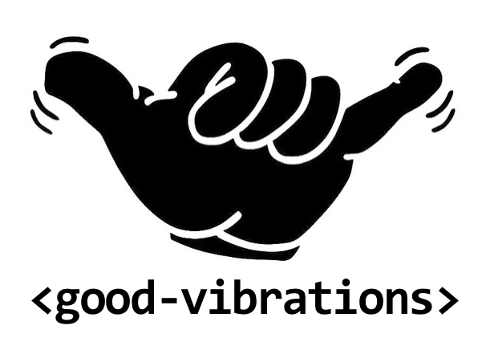

# &lt;good-vibrations&gt;

> `<good-vibrations>` is a component meant to be used as a singleton, that uses the [Vibration API](https://developer.mozilla.org/docs/Web/API/Vibration_API) to emit vibrations in browsers that support it.

<center></center>

__Example:__
```html
<good-vibrations vibrate duration="100"></good-vibrations>
```

__Example with vibration / silence intervals:__
```html
<good-vibrations vibrate duration="100,200,50,100,50,100,100,200,200,400,100,200,200"></good-vibrations>
```

__Canceling any running vibration:__
```js
document.querySelector('good-vibrations').cancel();
```

Or declaratively using the boolean attribute `mute`:
```html
<good-vibrations mute></good-vibrations>
```

__Get Vibration API support:__
```html
<good-vibrations vibration-supported="{{apiSupported}}"></good-vibrations>

<template is="dom-if" if="[[!apiSupported]]">
  <p>Vibration API not supported</p>
</template>
```
